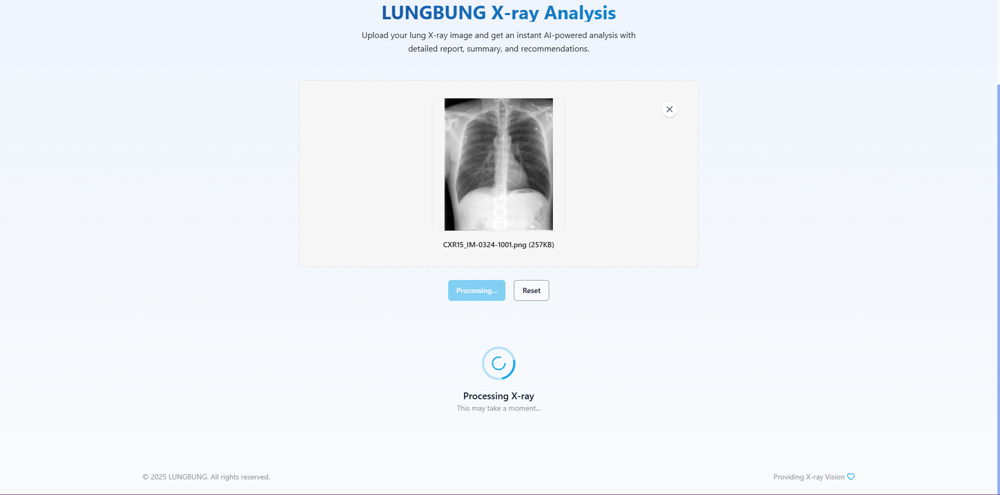

# LUNGBUNG X-ray Analysis Backend

## 1. Project Structure

The repository is structured to organize code, models, and dependencies, making it maintainable and scalable. The main components are:

- **app/**: Contains the core application logic, including model loading, prediction endpoint, and utility functions.
  - **main.py**: The entry point of the backend application. It sets up the FastAPI app, loads the models, and defines the prediction endpoint.
  - **models.py**: Defines the architecture of the CNN encoder, Transformer decoder, and the overall X-ray report generation model.
  - **utils.py**: Provides utility functions for image transformation, report generation, summarization, and suggestion generation.
- **models/**: Stores the downloaded machine learning models and associated files.
  - **model_checkpoints/**: Contains the saved weights for the encoder and decoder of the report generation model, along with vocabulary information.
  - **t5_model/**: Holds the files for the pre-trained T5 model used for summarization.
  - **t5_tokenizer/**: Contains the tokenizer files for the T5 model.
- **requirements.txt**: Lists the necessary Python libraries for the backend application to function.
- **Dockerfile**: Provides instructions for building a Docker image of the application, making it portable and easy to deploy.

## 2. Workflow

The application follows this workflow when a request is made to the `/predict/` endpoint:

1. **Image Input**: The endpoint receives an X-ray image file (PNG or JPG) as input.
2. **Image Transformation**: The `transform_image` function in utils.py resizes the image, converts it to a tensor, and normalizes it using the appropriate transformations.
3. **Report Generation**: The transformed image is passed to the `generate_report` function, which utilizes the loaded report generation model to produce a textual description of the X-ray findings.
4. **Summarization**: The generated report is then fed to the `generate_summary` function, which employs the T5 model to create a concise summary of the key findings.
5. **Suggestion Generation**: The summary is passed to the `generate_suggestions` function, which uses the Random Forest model to provide suggestions for further actions based on the summary's content.
6. **Output**: The endpoint returns a JSON response containing the generated report, summary, and suggestions.

## 3. Purpose

The overall purpose of this repository is to provide a backend system that can automate the analysis of X-ray images. It utilizes pre-trained and fine-tuned machine learning models to:

- Generate detailed reports describing the findings in the X-ray images.
- Create concise summaries of the reports for quick understanding.
- Offer suggestions for further actions, aiding healthcare professionals in diagnosis and treatment planning.

## 4. Screenshots of Working Application

### Upload Screen




### Analysis Results


## 5. Related Repositories

- **Frontend Repository**: [LUNGBUNG-frontend](https://github.com/junnyboy28/LUNGBUNG-frontend)

## 6. Getting Started

### Prerequisites
- Python 3.8+
- Docker (optional for containerization)

### Installation

1. Clone the repository
```bash
git clone https://github.com/your-username/LUNGBUNG-backend.git
cd LUNGBUNG-backend
```

2. Install dependencies:
```bash
pip install -r requirements.txt
```

3. Download required models:
```bash
python download_models.py
```

4. Run the application:
```bash
uvicorn app.main:app --reload
```
